# HyperSDK 🌀

Hyper Bridge Project: Seamlessly links Base & Optimism blockchains via Layer Zero Router. Swap native & wrapped tokens effortlessly. Empowers devs with user-friendly SDK for cross-chain interaction. Unlocking DeFi potential & blockchain adoption.

## Tech Stack

- Typescript
- Solidity
- AWS
- EthersJS
- Layer Zero
- UniswapV3

## Deployed Tokens

- Optimism (Göerli)

```sh
tWETH : 0xea4e3eB04d7EEb22B679D7d753AcCf5e54c6C019
tUSDC : 0x8A82c434F2701A44258173287aa0497856735386

decimals : tWETH : 18
decimals : tUSDC : 18
```

- Base (Göerli)

```sh
tWETH : 0xea4e3eB04d7EEb22B679D7d753AcCf5e54c6C019
tUSDC : 0x13B97ca2361C4649eB254d4d5c2baa89fF3c96a6

decimals : tWETH : 18
decimals : tUSDC : 18
```

Initial Price :

```sh
1 tWETH = 1500 tUSDC
MAX : 1550
MIN : 1450
```

## Layer Zero Settings

- Optimism (Göerli)

```sh
Chain ID : 10132
Endpoint : 0xae92d5aD7583AD66E49A0c67BAd18F6ba52dDDc1
```

- Base (Göerli)

```sh
Chain ID : 10160
Endpoint : 0x6aB5Ae6822647046626e83ee6dB8187151E1d5ab
```

## Uniswap V3 Settings

- Optimism (Göerli)

```sh
V3 Factory : 0xB656dA17129e7EB733A557f4EBc57B76CFbB5d10
V3 Swap Router : 0xE592427A0AEce92De3Edee1F18E0157C05861564
```

- Base (Göerli)

```sh
V3 Factory : 0x9323c1d6D800ed51Bd7C6B216cfBec678B7d0BC2
V2 Swap Router : 0x8357227D4eDc78991Db6FDB9bD6ADE250536dE1d
```

## Pool Links

| Network           | Pool Name     | Pool Link                                                                  |                                   Pool NFT                                    | Pool Address                                 |
| :---------------- | :------------ | :------------------------------------------------------------------------- | :---------------------------------------------------------------------------: | -------------------------------------------- |
| Optimism (Göerli) | `tWETH-tUSDC` | [https://app.uniswap.org/#/pools/106](https://app.uniswap.org/#/pools/106) |  | `0x8A82c434F2701A44258173287aa0497856735386` |
| Base (Göerli)     | `tWETH-tUSDC` | [https://app.uniswap.org/#/pools/2](https://app.uniswap.org/#/pools/2)     |          | `0x46769a055f5E2342Cef15DA5F132A2a549D3EbfB` |
